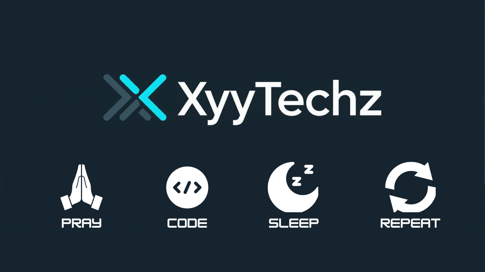
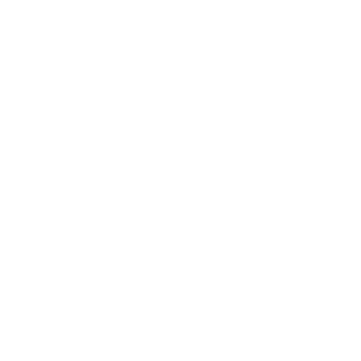
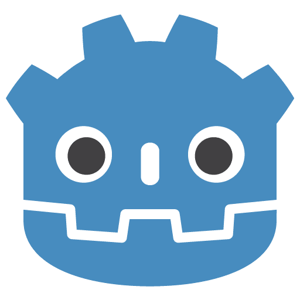

<!-- =============================== -->
<!--  GitHub Profile README          -->
<!--  Xyron Newell Y. Relon          -->
<!-- =============================== -->

<!-- Banner Section -->

  

<!-- Profile Header -->

 
  
  # Hi, I'm Xyron Newell Y. Relon  

  **BSIT Graduate** | **Web Developer** | **UI/UX & Frontend Specialist**  
   Toledo City, Cebu, Philippines

  <!-- Social Links -->
  

    
    
    
    
    
  

---

##  Professional Summary
BSIT graduate and **junior-level web developer** specializing in **UI/UX fundamentals** and **frontend development**. Experienced in building responsive, user-centered **web and mobile applications** using modern JavaScript frameworks and Python-based backends. Capable of working as a **Full-Stack Developer**, **Mobile App Developer**, and **Game Developer**. Adaptable learner with hands-on project experience and strong problem-solving skills.

---

##  Languages and Tools 

 
   
   
   
   
    
   
   
   
   
    
   
   
    

 

---

## 🚀 Selected Projects

### 🔹 VAWSAFE — Victim Safety Monitoring System
A mobile and web-based system designed to support **Violence Against Women and Children (VAWC) victims**. Includes secure user access, SOS alerts, case profiling, monitoring tools for social workers, and service coordination with local government units.

**Tech:** React Native · Firebase · Django · PostgreSQL  

---

### 🔹 Smart Maintenance & Asset Reporting System
A preventive maintenance platform with a web dashboard and mobile reporting app. Allows employees to report equipment issues with photos, receive task assignments, and view maintenance schedules. Designed for **government office operations**.

**Tech:** React · Django · Python · MySQL  

---

### 🔹 TaskFlow — Personal Productivity App
A clean and minimal task management application focused on usability and UI clarity. Features authentication, task categorization, color-coded tasks, theme switching, and real-time updates.

**Tech:** React Native · Firebase  

---

## 📊 GitHub Stats

  
  

---

## 🌱 Currently Learning
- Advanced React patterns and state management  
- UI/UX accessibility and design systems  
- Performance optimization  
- Exploring new frameworks and languages as required  

---

## 📁 Recommended Side Project Repositories
- `uiux-playground`
- `react-mini-projects`
- `django-practice-labs`
- `mobile-app-experiments`
- `godot-game-jams`

---

## 👋 Casual / Open-Source Bio
Hey! I’m Xyron — a frontend-focused developer who enjoys building clean interfaces, experimenting with side projects, and learning by doing. I mostly work with **React**, **Django**, and **mobile apps**, and I also explore **game development using Godot**. Always open to collaboration and new ideas.

⭐ Thanks for visiting my profile!
