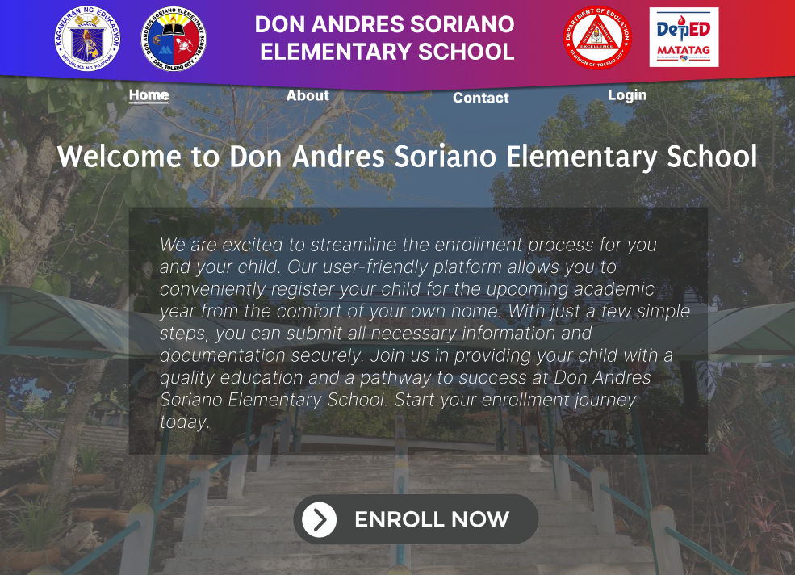

<!-- =============================== -->
<!--  GitHub Profile README          -->
<!--  Xyron Newell Y. Relon          -->
<!-- =============================== -->

<!-- Banner Section -->

  

<!-- Profile Header -->

 
  
  # Hi , I'm Xyron Newell Y. Relon  

  **BSIT Graduate** | **Web Developer** | **UI/UX & Frontend Specialist**  
   Toledo City, Cebu, Philippines

  <!-- Social Links -->
  

    
    
    
    
    
  

---

##  Professional Summary
BSIT graduate and **junior-level web developer** specializing in **UI/UX fundamentals** and **frontend development**. Experienced in building responsive, user-centered **web and mobile applications** using modern JavaScript frameworks and Python-based backends. Capable of working as a **Full-Stack Developer**, **Mobile App Developer**, and **Game Developer**. Adaptable learner with hands-on project experience and strong problem-solving skills.

---

##  Languages and Tools 

 
   
   
   
   
    
   
   
   
   
    
   
   
    

 

---

##  Selected Projects

###  Website-Based Enrollment System
Worked on the design and development of a web-based enrollment system to digitalize student registration and records management. Focused on front-end layout and form handling, database integration, and system usability to improve efficiency and data accuracy for school administrators.

**Tech:** HTML · CSS · JavaScript · PHP  · MySQL 

---

###  Case Monitoring and Confidential Profiling System
Developed a secure case monitoring system for Violence Against Women and Children (VAWC) victims. Implemented confidential profiling, role-based access, and case tracking features, with emphasis on data privacy, ethical handling of sensitive information, and organized case documentation.
  

**Tech:** Django · Python · PostgreSQL · Tailwind CSS · JavaScript

---

###  2D Shooting Game
Designed and developed a 2D shooting game using the Godot Engine. Implemented player mechanics, enemy behavior, collision detection, scoring systems, and basic game physics. Applied iterative testing and debugging to enhance gameplay performance.

**Tech:** Godot Engine · GDScript  

---

##  GitHub Stats

  
  

---

##  Currently Learning
- Advanced React patterns and state management  
- UI/UX accessibility and design systems  
- Performance optimization  
- Exploring new frameworks and languages as required  

---

##  Recommended Side Project Repositories
- `uiux-playground`
- `react-mini-projects`
- `django-practice-labs`
- `mobile-app-experiments`
- `godot-game-jams`

---

  Thanks for visiting my profile!
