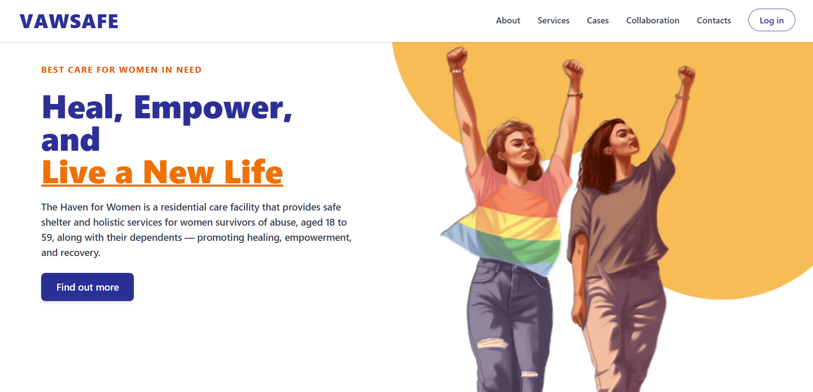

<!-- =============================== -->
<!--  GitHub Profile README          -->
<!--  Xyron Newell Y. Relon          -->
<!-- =============================== -->

<!-- Banner Section -->

  

<!-- Profile Header -->

  # Hi , I'm Xyron Newell Y. Relon  

  **BSIT Graduate** | **Web Developer** | **UI/UX & Frontend Specialist**  
   Toledo City, Cebu, Philippines

---

##  Professional Summary
BSIT graduate and **web developer** specializing in **UI/UX** and **frontend development**. Experienced in building responsive, user-centered web and mobile applications with modern frameworks and Python-based backends. Adaptable learner with strong problem-solving skills.  

**Fun Facts:**  
- 🎮 I love games, especially F2P and gacha titles  
- 🎸 Multi-talented: play instruments and enjoy various sports  
- 💪 Fitness enthusiast — I go to the gym in my free time  

---

##  Languages and Tools 

### Programming Languages

   
   
   
   
   
   
   

### Frameworks & Libraries

   
   
   

### Databases

   
   <!-- PostgreSQL -->

### Tools & Platforms

   
   
   

---

##  Currently Working On
**VAWSAFE: Case Monitoring and Confidential Profiling System**  
A secure platform supporting Violence Against Women and Children (VAWC) case management, with role-based access, confidential profiling, and monitoring tools for social workers and government units.  

  

---

##  Connect With Me

   **Phone:** +63 927 732 4050  

   **Email:** relonxyronnewell@gmail.com  

---

 Thanks for visiting my profile!
